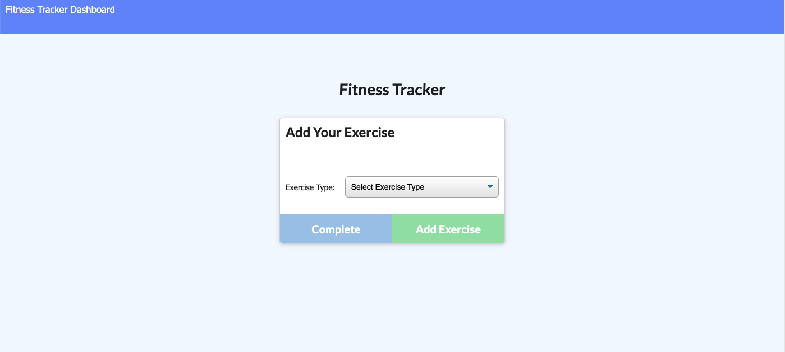
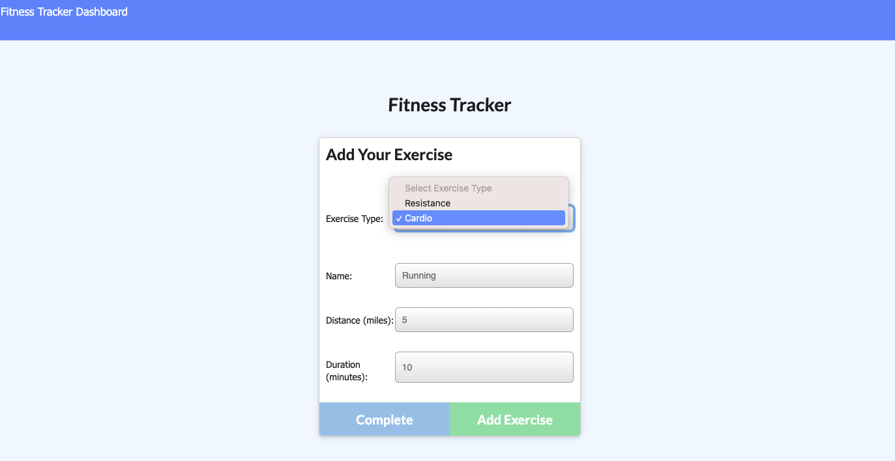
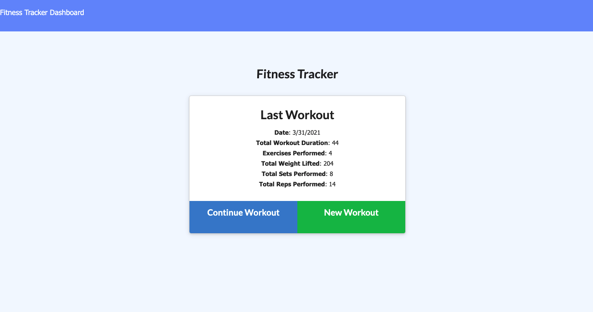
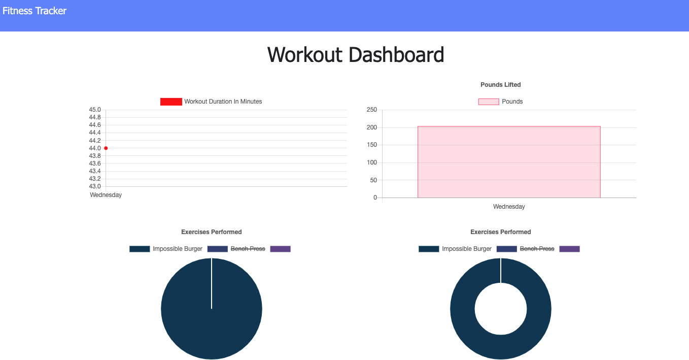

# mongo_fitness_tracker
Fitness Tracker Using Mongo

# Description
As a user, I want to be able to view create and track daily workouts. I want to be able to log multiple exercises in a workout on a given day. I should also be able to track the name, type, weight, sets, reps, and duration of exercise. If the exercise is a cardio exercise, I should be able to track my distance traveled.

# Technologies
* [Node.js](https://nodejs.org/en/)
* [Express](https://expressjs.com/)
* [Mongoose](https://mongoosejs.com/)
* [MongoDB](https://www.mongodb.com/)
* [MongoDBAtlas](https://www.mongodb.com/cloud/atlas/)

# Deployed Application
This application is deployed on [Heroku](https://afternoon-river-21848.herokuapp.com/?id=60652c20cd48880015f1cc6e)

# Screenshot of the Application

